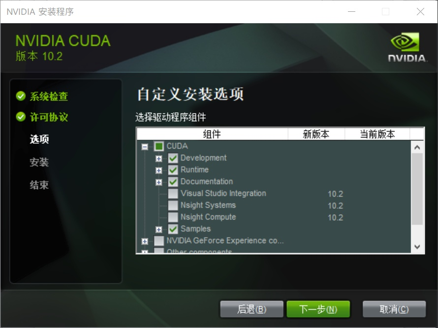
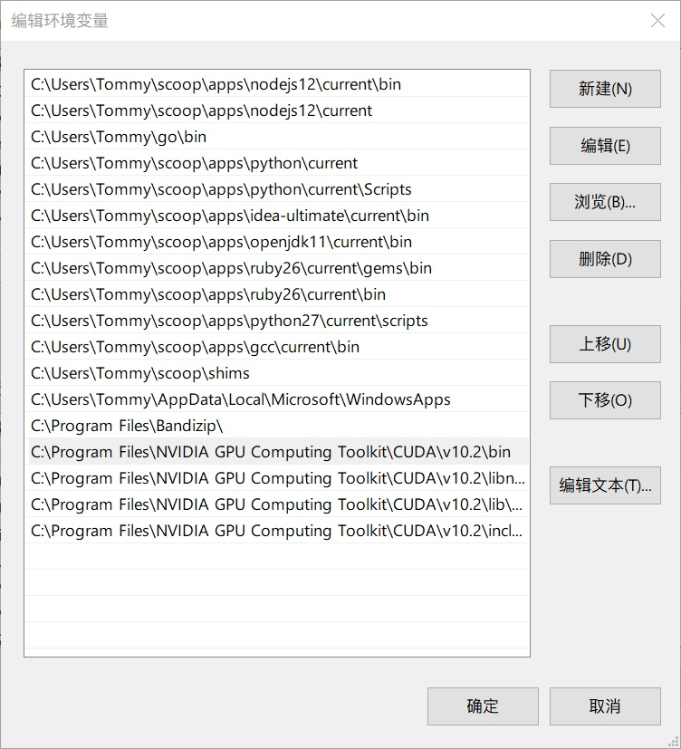

# 本机配置 CUDA 与 pip

这篇文档记录一下如何在自己的电脑上配置 CUDA 与 pip。

如果你使用的系统支持 Nvidia 显卡，可以利用 CUDA 与 cuDNN 套件，对常用的 python 机器学习库进行加速。pip 是默认的 python 包管理器，但在校外网使用时偶尔会遇到卡顿问题，可以通过更换安装源解决。

```note:: 用 N 卡加速机器学习。套件包含 CUDA、cuDNN 等。配置 pip，记录常用包的安装指令。

```

## 配置 CUDA、cuDNN

### 关于

-   CUDA：CUDA（ComputeUnified Device Architecture），是显卡厂商 NVIDIA 推出的运算平台。 CUDA 是一种由 NVIDIA 推出的通用并行计算架构，该架构使 GPU 能够解决复杂的计算问题。
-   cuDNN：NVIDIA cuDNN 是用于深度神经网络的 GPU 加速库。它强调性能、易用性和低内存开销。NVIDIA cuDNN 可以集成到更高级别的机器学习框架中，如谷歌的 Tensorflow、加州大学伯克利分校的流行 caffe 软件。简单的插入式设计可以让开发人员专注于设计和实现神经网络模型，而不是简单调整性能，同时还可以在 GPU 上实现高性能现代并行计算。

```note:: 一般来说，安装完 CUDA 也需要进一步安装 cuDNN 套件。

```

### 安装 CUDA

-   安装 CUDA 套件之前，查看一下当前系统识别到的显卡所支持的 CUDA 版本。

    

-   从[官网](https://developer.nvidia.com/cuda-toolkit)下载合适的版本安装包。暂时推荐 10.2！等多数第三包更新支持 11 后再进行迁移。

    ```warning:: 20201201，目前最新的 CUDA 版本号为 11.1，但仍然推荐使用上一个大版本最后的稳定版本，目前为 10.2。

    ```

-   打开安装包进入安装流程，注意不要选择默认安装，选择自定义模式，仅需安装以下几个组件。注意一下实际的安装路径。

    

    ```warning:: 请勿选择默认的安装模式，进行勾选其中 CUDA 部分组件即可。

    ```

-   正常来说安装完成后，相应的环境变量可以自动配置完成。如果没有，需要手动配置相应的环境变量，包含 bin、include、lib、libnvvp 几个文件夹，将其添加到用户级别的环境变量即可。

    

-   检查版本号。

    ```powershell
    PS C:\Users\Tommy> nvcc -V
    nvcc: NVIDIA (R) Cuda compiler driver
    Copyright (c) 2005-2019 NVIDIA Corporation
    Built on Wed_Oct_23_19:32:27_Pacific_Daylight_Time_2019
    Cuda compilation tools, release 10.2, V10.2.89
    ```

### 安装 cuDNN

-   [官网](https://developer.nvidia.com/rdp/cudnn-download)下载解压 cuDNN 文件，解压缩，将得到的三个文件夹的内容复制粘贴到 CUDA 安装目录即可完成安装。

    ```powershell
    C:\Program Files\NVIDIA GPU Computing Toolkit\CUDA\v10.2\
    ```

### 使用 torch 库检查 CUDA

PyTorch 是最常用的一个可以直接利用 CUDA 库的 python 第三方包了。我们用它来了验证一下 CUDA 的安装是否完成。这里列举一些 `torch` 关于 CUDA 的操作。

```python
>>> import torch
>>> torch.__version__
'1.6.0'
>>> torch.version.cuda
'10.2'
>>> torch.cuda.is_available() # check CUDA availablity
True
>>> torch.cuda.device_count() # GPUs
1
>>> torch.cuda.current_device() # index of devicein use
0
>>> torch.cuda.get_device_name(0) # GPU device name
'GeForce RTX 2060'
>>> torch.cuda.get_device_capability(0) # capability of device
(7, 5) # the major and minor cuda capability of the device
>>> torch.cuda.empty_cache() # free up GPU devices in use
```

```note:: 这是在终端中的 python 交互库中完成的。直接在终端中输入 python 即可进入。

```

## 配置 pip

前段时间用了 yarn 之后，倍感 yarn 指令的亲切感。可惜目前来说，pip 还没有特别优秀的替代品，在一些安装配置指令上还有些不尽人意的地方。

另外一个比较值得注意的地方，pip 不存在项目环境与全局环境，所有第三方包均安装在全局目录下，这一点上来说，对项目快速部署不是特别友好。目前常见的方案是常见虚拟环境，如 conda，pipenv 等。

配置 pip，主要是对默认的源进行替换。

### pip 换源与配置

-   注意不同系统中，配置文件存放的位置不同。

    ```sh
    # Linux
    mkdir ~/.config/pip
    sudo vi ~/.config/pip/pip.conf

    # macOS
    mkdir ~/.pip
    sudo vi ~/.pip/pip.conf

    # windows
    sudo vi %HOMEPATH%\pip\pip.ini
    ```

-   替换源尽量使用 `https`，新版 ubuntu 要求使用 `https` 源。实测学院网连接清华的源很慢，可能也是因为 `https` 的原因。以下三个常用靠谱国内镜像源，选择其一即可。

    ```sh
    # mirrors
    http://mirrors.aliyun.com/pypi/simple/
    https://pypi.tuna.tsinghua.edu.cn/simple/
    http://pypi.mirrors.ustc.edu.cn/simple/
    ```

-   打开配置文件，覆盖其中的内容。

    ```sh
    [global]
    index-url = http://mirrors.aliyun.com/pypi/simple/
    trusted-host = mirrors.aliyun.com
    timeout = 30
    disable-pip-version-check = true

    [list]
    format = columns
    ```

### 常用库安装指令

-   列举一些常用的第三方包安装指令。注意，torch 有无 CUDA 的安装指令是不一样的，具体可以查看官网。

    ```sh
    # pip 20.2(python 3.8)
    # pip tools
    pip install pip black pip-check pip-review
    # nice env
    pip install jupyterlab spyder
    # data process base
    pip install numpy pandas scipy
    # machine learning
    pip install scikit-learn
    # data visualization
    pip install matplotlib
    # network and transmitting
    pip install paho-mqtt
    # file IO and database
    pip install h5py pyyaml pymysql
    # encoding tools
    pip install chardet
    # funny tools
    pip install sphinx sphinx-rtd-theme sphinx-autobuild recommonmark prettytable

    # torch win with/without CUDA
    pip install torch===1.6.0 torchvision===0.7.0 -f https://download.pytorch.org/whl/torch_stable.html
    pip install torch torchvision
    ```

-   一般的代码对第三方包版本的要求不是特别严格，所以对于这类依赖包、库不用特别更新。但一些用于终端的开发工具可以适当地进行更新。

    ```sh
    # pip-check
    pip-check -Hu

    # pip-review
    pip-review -i
    ```
