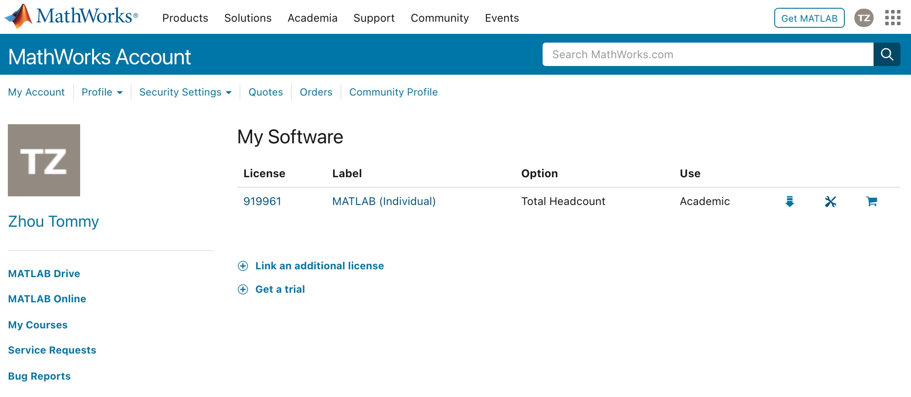
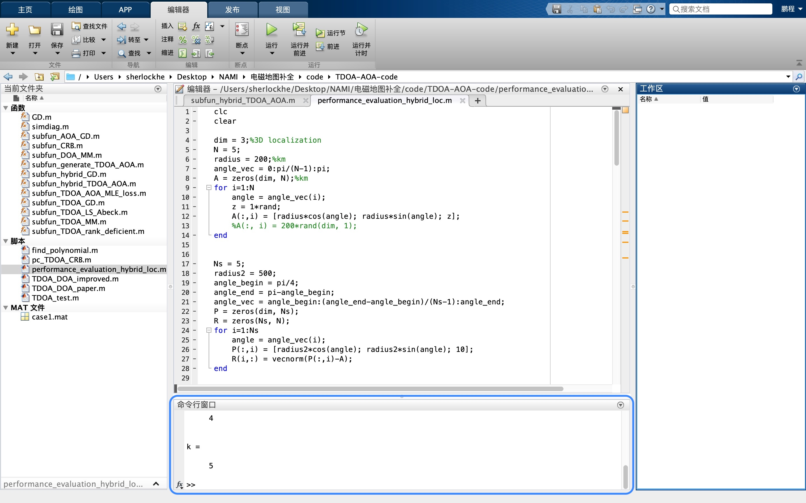
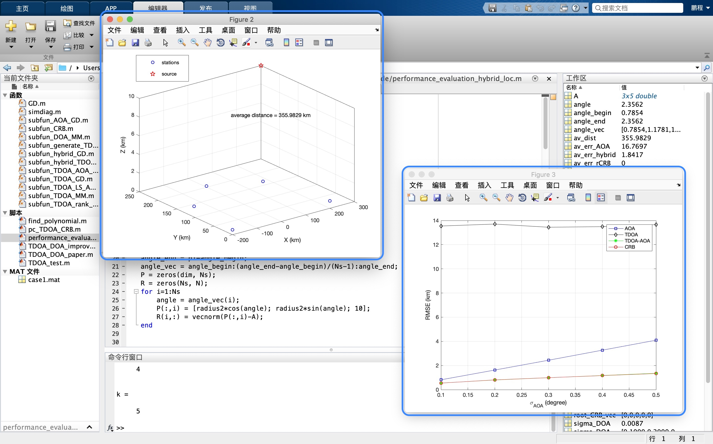
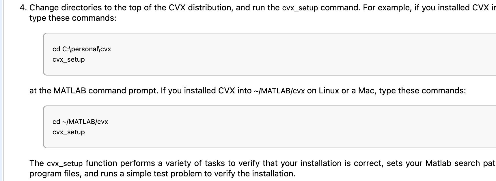

# 服务器 MATLAB 使用手册

MATLAB 本身是一个强图形化界面依赖的程序，但跟所有软件一样，图形界面只是指令集合（可执行指令集）的外包装，MATLAB 同样可以通过终端运行，执行对应文件的内容并显示输出。

这份手册简要介绍一下使用 SSH 连接、终端操作 MATLAB 运行代码文件的方法。

```note:: MATLAB 同样支持在终端执行。对于早期 MATLAB 版本管理员需要手动链接可执行文件到环境变量。

```

## 基准方案：欢迎来 442 写代码

在开始介绍之前，大家需要了解的是，阿圆学长 `hpc@nami-442` 已经在 442 写过累计超过 240 小时工作量的代码。

是的，如果出现各种文档参考或意料之外的情况，眼前又有迫切需要完成的 MATLAB 项目，欢迎大家直接来到老大的巢穴 442，在服务器本机上，完成项目代码的编译与运行工作。

```note:: 👍 这绝对是最为保险、最为直接的做法。

```

## 了解一下：有个矛盾的权限问题

在了解具体的使用方式之前，管理员有必要了解关于 MATLAB 可执行程序的一些权限问题。

目前，服务器有三类按权限区分的账户：

-   **root**：系统最高权限账户，唯一，不可修改；
-   **nami-442**：管理员账户，设置为唯一，不应修改；
-   **nami-matlab**：管理员账户，设置为唯一，不应修改；
-   **username**：普通账户，不唯一，可修改。

在 MATLAB 安装与激活的过程中，为了省去不必要的权限问题（包括 MATLAB 安装时创建文件与软连接的权限），全程使用了具备管理员权限的特殊账户 `nami-matlab@nami-442` 执行相应的安装、授权、激活过程（使用管理员申请的 Academic License）。



而目前，MATLAB 在启动时，会检测当前执行账户是否为激活时账户。这意味着，如果采用创建拥有权限账户组的方式，组内的普通账户仍然不能通过自己的账户执行 MATLAB 程序；但当初安装激活时，非管理员权限的普通账户并不能顺利地完成安装过程——这就是目前的权限矛盾。

```warning:: 除非精心设计好一个拥有安装过程所需权限、又不具备管理员权限的特殊普通账户，否则目前来说，只能使用管理员账户打开 MATLAB。⚠️ 这是一个潜在的危险。

```

因此，目前 442 服务器采取的方式是：

-   创建拥有管理员权限的特殊账户，也就是 `nami-matlab@nami-442` 负责完成 MATLAB 的安装过程。
-   同时，该账户也是后续大家尝试在服务器使用 MATLAB 的唯一账户。
-   因此希望大家合理使用该账户，将其作为、仅作为使用 MATLAB 的登录账户，请勿进行不必要的其他操作。
-   当然，出于安全考虑，管理员对该账户的某些权限做了限制。

## 了解一下：MATLAB 环境变量

早期的 MATLAB 安装完成后（实测包活 R2020a 之前版本），需要手动在环境变量中添加 MATLAB 可执行程序，或者在终端配置文件中添加快捷方式，直接导入可执行文件路径。

这样才能在终端中识别到 `matlab` 指令。

-   管理员可以这样添加 MATLAB 可执行文件路径（注意检查本机的文件路径）。

    ```sh
    # add matlab as an alias
    alias matlab="sudo /usr/local/bin/matlab"
    ```

-   SSH 登录之后，大家可以这样验证终端是否识别 MATLAB 指令（当然，只能使用唯一的 MATLAB 专用账户 `nami-matlab@nami-442` 登录）。

    ```sh
    nami-matlab ~ > which matlab
    /usr/local/bin/matlab
    ```

## 开始使用：SSH 连接，MATLAB 指令

配置完成之后，我们可以使用 SSH 远程登录的方式控制服务器，使用上面的 MATLAB 运行自己的文件。

### 随时查看指令帮助

如果不熟悉 `matlab` 指令的使用方式，可以随时查看指令帮助。

-   使用 `matlab -help` 查看所有的指令参数；

    ```sh
    nami-matlab ~ > matlab -help

        Usage:  matlab [-h|-help] | [-n | -e]
                       [v=variant]
                       [-c licensefile] [-display Xdisplay | -nodisplay]
        ...
    ```

-   比较重要的几个参数如下。可以在[这里](https://ww2.mathworks.cn/help/matlab/ref/matlabmacos.html)找到更为详细的说明。

    ```sh
    ...
        -nodisplay              - Do not display any X commands. The MATLAB
                                  desktop will not be started. However, unless
                                  -nojvm is also provided the Java virtual machine
                                  will be started.
        -nosplash               - Do not display the splash screen during startup.
        -nodesktop              - Do not start the MATLAB desktop. Use the current
                                  terminal for commands. The Java virtual machine
                                  will be started.
        -r MATLAB_command       - Start MATLAB and execute the MATLAB_command.
                                  Cannot be combined with -batch.
        -logfile log            - Make a copy of any output to the command window
                                  in file log. This includes all crash reports.
    ...
    ```

### 常用的指令形式

如果没有特殊要求，可以使用如下推荐的指令形式。简单复制粘贴指令到终端，修改运行文件的路径即可。

```note:: 不熟悉终端指令操作的小伙伴，在这里复制粘贴指令即可。

```

默认情况下，使用指令运行单一的 `.m` 文件。注意，在后续的指令中，所有指令中的文件路径都不包含文件后缀 `.m`。

```note:: 这些指令禁用了 MATLAB 的图形化界面与相关输出，适用于终端。

```

-   **最常用**：适用于终端 SSH 连接启动的 MATLAB；

    ```sh
    matlab -nodesktop -nodisplay -nosplash -r [matlab_file]
    ```

-   **有日志**：添加、指定输出相应的日志文件；

    ```sh
    matlab -nodesktop -nodisplay -nosplash -logfile `matlab_log_%Y_%m_%d-%H_%M_%S`.log -r [matlab_file]
    ```

-   **交互式执行**：如果需要交互代码式执行，无需添加文件路径。

    ```sh
    matlab -nodesktop -nodisplay -nosplash
    ```

    交互式界面如下：

    ```sh
    nami-matlab ~ > matlab -nodesktop -nodisplay -nosplash

                                    < M A T L A B (R) >
                        Copyright 1984-2020 The MathWorks, Inc.
                    R2020b Update 3 (9.9.0.1538559) 64-bit (glnxa64)
                                    November 23, 2020


    To get started, type doc.
    For product information, visit www.mathworks.com.
    >>
    ```

⚠️ 大家应始终注意：

-   在正确的路径下运行指令，或在指令中指定正确的路径，且文件路径中不含文件后缀 `.m`；
-   程序若有文件的读取与保存，同样要设置好相关路径；
-   在 `.m` 源文件中设置好关键位置的输出，方便在终端查看到目前执行的进度；
-   不要使用 `nohup` 之类的指令使得 MATLAB 始终保持在后台运行，它的占用消耗比较大；
-   使用日志文件可以帮助你了解程序中的关键信息，即使不小心退出了终端、意外关闭连接，也可以查看日志文件找到关键输出。

```warning:: 再次，指定正确的路径非常重要。

```

### 查看代码运行时输出

🧠 大家需要注意的是，如何查看代码运行的输出。

首先要清楚，在自己电脑上使用正常的 GUI 模式下的 MATLAB 时，我们有两种方式查看代码的运行情况：一种是直接查看 MATLAB 内置终端的输出（命令行窗口）；一种是相应片段执行完成后，界面弹出，显示结果。





当执行命令行模式下的 MATLAB 时：

-   此时 MATLAB 并没有以 GUI 模式运行，因此所有通过界面显示的内容都不会存在。即使代码中调用了相关的图形显示，这些都不会执行，当然源码并不会被识别为错误代码。
-   另一方面，所有在 MATLAB 内置终端中显示的输出，都会同样出现在终端中，两者表现一致。

如果通过终端输出、查看结果的方式并不能满足需求，我们需要考虑将代码中的关键输出、结果、或者单纯的变量内容输出到额外的文件中，保存起来，方便我们通过本机下载，查看运行结果，具体可以参考这里，[链接](https://ww2.mathworks.cn/help/matlab/ref/save.html)。

```matlab
% save key variables into files
save(filename)
save(filename,variables)
save(filename,variables,fmt)
save(filename,variables,version)
save(filename,variables,version,'-nocompression')
save(filename,variables,'-append')
save(filename,variables,'-append','-nocompression')
save filename
```

### 指令运行多份文件

如果需要一次性运行多个 `.m` 文件（这些文件可能不存在任何的依赖关系），我们需要编写额外的一个脚本，通过如下两种指令方式来依次运行多个文件。

-   直接输入文件名称，同样不含后缀 `.m`。

    ```matlab
    clc
    close all % clearup previous dialog

    clear
    file1 % name of the first .m file

    clear % clear log of last file
    file2 % name of the second .m file

    clear % clear log of last file
    file3 % name of the third .m file
    ```

-   使用 `run()` 函数调用文件，需要保留后缀。更多内容参考官方文档，[链接](https://ww2.mathworks.cn/help/matlab/ref/run.html)。

    ```matlab
    clc
    close all % clearup previous dialog

    clear
    run( 'file1.m' ) % name of the first .m file

    clear % clear log of last file
    run( 'file2.m' ) % name of the second .m file

    clear % clear log of last file
    run( 'file3.m' ) % name of the third .m file
    ```

```note:: 完成额外运行脚本编写后，可以将其保存为单独的脚本文件，然后以上小节同样的方式运行该脚本即可。

```

### 代码需要额外的依赖库

我们在服务器上安装的 MATLAB 采用了完整的安装模式，所有可选组件均已安装。

```note:: 20201214，安装了最新版的 R2020b Update 3 (9.9.0.1538559) 64-bit (glnxa64)。

```

一般来说，我们不再需要使用额外的依赖库或者包。当然，难免有时候出现了额外的需求，例如 `zly@nami-442` 学长曾在项目中使用了 CVX，一款著名的凸优化处理依赖库，官网[链接](http://cvxr.com/cvx/)。对于 MATLAB 来说，目前没有标准的依赖库安装方式，基本流程都是运行依赖库文件中的初始化脚本，实现依赖的引入，例如 CVX 包的引入，[链接](http://cvxr.com/cvx/doc/install.html)。



如果大家在项目中有依赖库的需求，目前来说，请直接联系管理员进行安装，大家注意确认使用依赖库的版本与适配情况即可。

```note:: 如果你运行的 MATLAB 文件需要额外的依赖库，请联系管理员进行相关安装配置。

```

### 执行完成后：退出指令环境

执行完成文件后，MATLAB 并不会自动退出环境，使用 `exit` 指令即可退出，返回正常的 SSH 连接终端界面。

-   使用 `exit` 即可。

    ```sh
    ...
    >> exit
    nami-matlab ~ >
    ```

## 后续参考：这里有一份完整流程

首次阅读请耐心了解上面的内容。后续参考可以直接在这里找到完整的使用流程，[链接]()。
