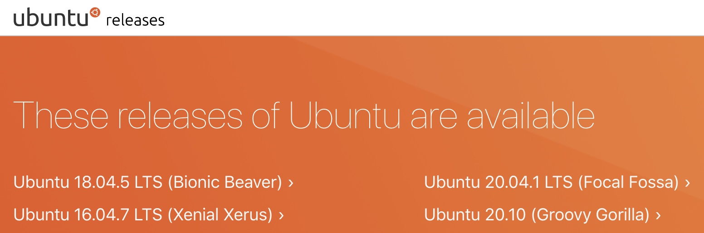
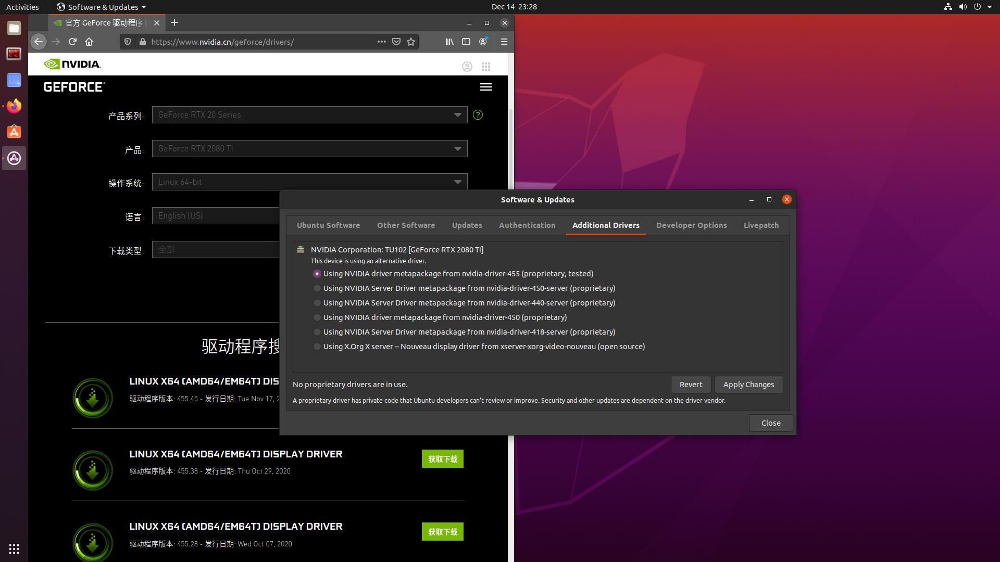
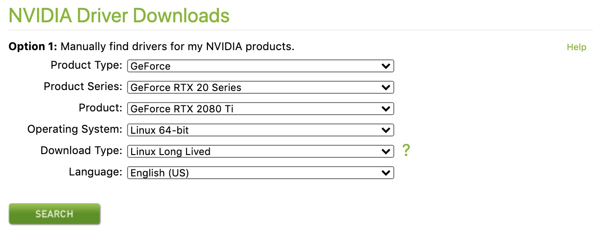
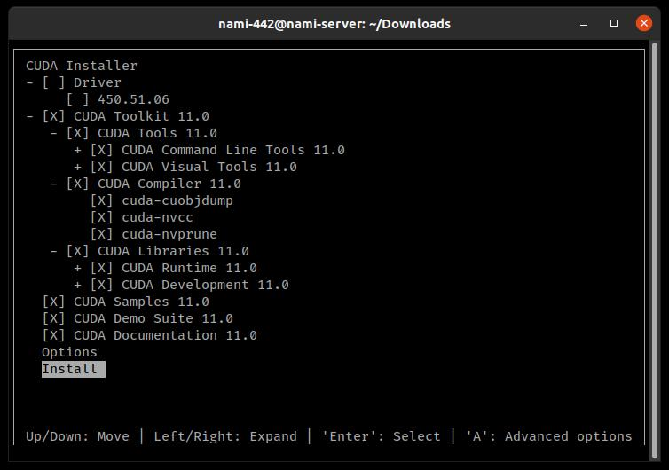

# 重装 Ubuntu 系统与驱动

本篇文档记录重装 442 服务器系统的基本流程。

```warning:: ⚠️ 注意，该服务器使用的是 Ubuntu 系统桌面版，部分服务程序需要长期保持在后台，包括部分项目的数据接收、数据库远程访问、项目主页展示等等。请在详细了解、确认后台包含的服务之后，与项目负责人进行沟通，并完成必要项目的迁移，最后再执行重装操作。

```

442 服务器最近一次系统级别重新配置时间：20201214。

可以使用如下指令查看上一次系统重装时间：

```sh
# check system mounted hard disk, nvme by default
> df -P /
Filesystem     1024-blocks      Used Available Capacity Mounted on
/dev/nvme0n1p2   490691512 238371724 227324308      52% /

# grep filesystem created timestamp
> tune2fs -l /dev/nvme0n1p1 |grep 'Filesystem created:'
Filesystem created:       Mon Dec 14 10:24:44 2020
```

```note:: “服务器又要重装了。”——希望后面少听到这句工作量满满的话 😂。

```

## 重装系统

```warning:: ⚠️ 重装系统之前，请确保已经完成了必要的项目迁移，备份了相关资料数据。

```

### 准备内容

重装服务器之前，准备：

-   一个容量大于等于 8G 的 U 盘或移动硬盘；
-   合适的 Ubuntu 系统镜像，推荐使用最新或次新 LTS 版本，选择桌面版系统，官网[链接](https://releases.ubuntu.com/)；
-   免费的系统镜像写入软件 Etcher，官网[链接](https://www.etcher.net/)；



### 重装流程

以下为通用的系统重装步骤：

-   使用 Etcher 软件，将下载好的系统镜像写入 U 盘，制作为可引导启动盘（这个过程通过 Etcher 完成非常轻松）；
-   插入 U 盘，长按关机键重启服务器主机，在显示器重新出现主板厂商图案时，按 `del` 键进入主板 BIOS 设置界面（具体过程参见不同主板的说明书）；
-   在 BIOS 界面调整引导盘顺序，将插入的 U 盘设置为第一启动引导项；
-   保存 BIOS 设置，重启服务器主机；
-   从 U 盘加载启动镜像可能需要一些时间，耐心等待后，进入常规的系统安装流程。

### Ubuntu 系统安装流程

多数安装过程重的设置项选取默认即可，这里列举一些需要注意的设置项：

-   系统语言保持英文，系统安装完成后再手动添加中文输入法；
-   接受附带的图形、媒体组件等额外包的安装，接受安装时下载更新；
-   安装类型选取清除整个磁盘，进行彻底的重新安装；
-   设置合适的计算机名称、用户名与密码，该用户为系统管理员账户，如 `nami-442`；

```note:: 系统更新维护需要中断服务，因此在安装时尽量保持安装包的为最新的版本，后续再定期执行更新。

```

### 注意事项

提前知晓这些注意事项：

-   442 服务器并非一般所说的服务器，它更多地是一台性能优越的共享主机，因此依然适用于 Ubuntu 系统桌面版。
-   实践来看，这台服务器重启的过程比较缓慢，在显示器通电之后会保持黑屏一段时间，推测是在进行磁盘阵列的检查，因此请耐心等待（可能长达 10 分钟）。
-   Linux 类系统提供了 6 个虚拟终端，其中第 1 个是默认的图形界面，第 2 到 6 个则是命令行界面。可以通过 `ctrl` + `alt` + `F1[~6]` 组合键在不同的虚拟终端之间进行切换。这适用于多任务处理，或者其中某个终端出现卡死的情况。
-   请熟悉基本的 Linux 类系统指令。

## 安装 Nvidia 驱动

### 20.04 及之后

```important:: 20201214 更新：在最新的 Ubuntu 20.04 系统下，可以很方便地使用自带的驱动管理，自动安装合适的 Nvidia 驱动。

```



选取合适的驱动版本后，点击 Apply Changes 即可。系统完成驱动安装后会要求重启。

### 18.04 及之前

对于 18.04 版本之前的 Ubuntu 系统参考一下步骤。在系统安装过程中，多数硬件驱动会自动安装最适合版本或基本的兼容版本，不用花心思去手动适配，它们一般能很好地配合系统硬件工作。

唯独需要注意的，Nvidia 显卡的驱动不在可自动安装驱动的支持列表内，因此需要手动进行安装。这里列举安装 Nvidia 显卡在 Ubuntu 系统上驱动的步骤。

```warning:: 无法在 SSH 远程连接模式下完成驱动的安装，请在 442 服务器本机上进行操作。

```

基本地，我们需要禁用系统自动适配的第三方显卡驱动，进入没有图形界面的命令行终端模式；安装必要的依赖包后，手动安装 Nvidia 显卡驱动；最后重启系统。

```note:: 禁用第三方显卡驱动后，系统不再提供图形化界面，切换到命令行终端执行后续操作。

```

-   首先确认系统识别到了 Nvidia 卡。Nvidia 卡型号与 Ubuntu 版本大致匹配就行。

    ```sh
    # show nvidia graphic card items
    > lspci | grep -i nvidia
    19:00.0 VGA compatible controller: NVIDIA Corporation Device 1e04 (rev a1)
    19:00.1 Audio device: NVIDIA Corporation Device 10f7 (rev a1)
    19:00.2 USB controller: NVIDIA Corporation Device 1ad6 (rev a1)
    19:00.3 Serial bus controller [0c80]: NVIDIA Corporation Device 1ad7 (rev a1)
    ...
    ```

    这里出现 NVIDIA Corporation Device 信息即可，表示系统已经识别到了该显卡。

-   禁用自动适配的第三方驱动 nouveau。

    ```sh
    # new .conf
    vim /etc/modprobe.d/blacklist.conf

    # add config
    blacklist nouveau
    options nouveau modeset=0

    # refresh and reboot
    update-initramfs -u
    reboot

    # checkup now, outputs ought to be none
    lsmod | grep nouveau
    ```

-   在安装 Nvidia 驱动之前，先添加依赖包。

    ```sh
    # install compile depended packages
    apt install build-essential pkg-config xserver-xorg-dev linux-headers-`uname -r`
    apt install gcc make
    ```

-   下载驱动安装程序，[链接](https://www.nvidia.com/Download/index.aspx)，下载得到 `.run` 文件，使用 bash 执行该安装文件，最后重启检查是否安装成功。

    

    ```sh
    # switch to terminal mode
    ctrl + alt + fn # f7 for GUI

    # stop GUI service
    service lightdm stop

    # chmod and install
    chmod +x NVIDIA-Linux-x86_64-450.27.run
    bash NVIDIA-Linux-x86_64-450.27.run –no-opengl-files –no-x-check –no-nouveau-check
    # note: might be some minor warnings; no 32bit installations.

    # reboot and check
    reboot
    nvidia-smi
    ```

## 安装 CUDA

CUDA 自然是跑不掉的。CUDA 版本请根据当前软件包的适配情况进行选择。

-   下载 CUDA 安装程序，[链接](https://developer.nvidia.com/cuda-10.2-download-archive)，得到 `.run` 文件，使用 bash 执行安装。

    ```sh
    # install
    bash cuda_10.2.xxx._linux.run
    ```

    这里会进入一个非常简单的命令行图形化安装界面，在过程中，多数选项保持默认值，但需要取消选中是否附带安装显卡驱动的选框。

    

    ```note:: 安装 CUDA 时，取消它附带的显卡驱动安装，我们在之前的步骤中已经安装过驱动文件。

    ```

-   在对应的用户配置文件中，添加 CUDA 的环境变量。添加之后 `source` 一下，应该就可以用 `nvcc -V` 指令了。

    ```sh
    export PATH="/usr/local/cuda-10.2/bin:$PATH"
    export LD_LIBRARY_PATH="/usr/lcoal/cuda-10.2/lib64:$LD_LIBRARY_PATH"
    ```

-   最后，可以使用如下指令，检查 CUDA 版本。

    ```sh
    # check cuda version
    cat /usr/local/cuda/version.txt
    nvcc -V
    ```

## 安装 cuDNN

cuDNN 是一个代码级别的运行加速库，通常需要与 CUDA 同时安装。

-   下载 cuDNN 压缩文件，[链接](https://developer.nvidia.com/rdp/cudnn-archive)，得到 `tgz` 文件。解压缩，复制文件到相应文件夹即可完成安装。

    ```sh
    # unpack
    tar -zxvf cudnn-10.2-linux-x64-v7.6.5.32.tgz

    # cp
    cp cuda/include/cudnn.h /usr/local/cuda/include/
    cp cuda/lib64/libcudnn* /usr/local/cuda/lib64/
    chmod a+r /usr/local/cuda/include/cudnn.h
    ```

-   可以使用如下指令，检查 cuDNN 版本。

    ```sh
    # check cudnn version
    cat /usr/local/cuda/include/cudnn.h | grep CUDNN_MAJOR -A 2
    ```
