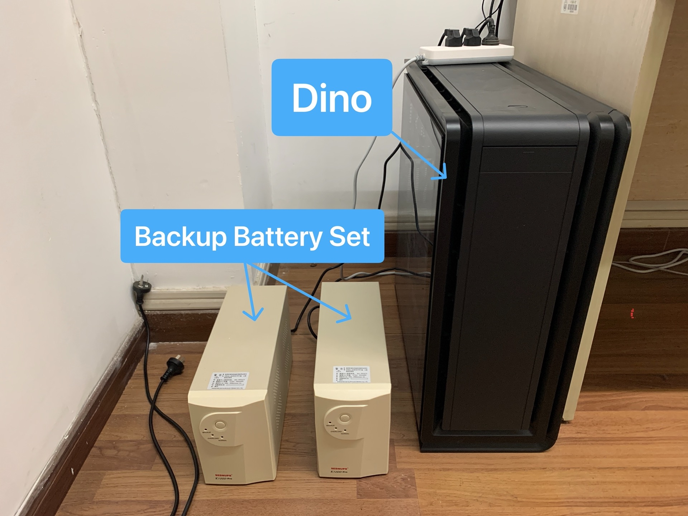

# 系统硬件信息

NaMI 网络与机器智能实验室配备了一台服务器，是一台简简单单的一台具备 4 张 2080Ti 显卡的小电脑，它的正式身份叫做 `nami-442`，也有一个不错的昵称叫 Dino。Dino 常年摆放在同济大学嘉定校区济事楼 442 房间，与我们的老大朝夕相处。

作为针对这台服务器的完整文档的第一篇，我们先来简单介绍一下 Dino 服务器的基本信息。

## Hardware

部分主要硬件配置信息如下。

-   **Motherboard**：Gigabyte X299-WU8 ([ref](https://www.gigabyte.cn/Motherboard/X299-WU8-rev-10#kf))
-   **CPU**：Intel Core i9-9980XE ([ref](https://ark.intel.com/content/www/cn/zh/ark/products/189126/intel-core-i9-9980xe-extreme-edition-processor-24-75m-cache-up-to-4-50-ghz.html))
-   **GPU**：ASUS TURBO-RTX2080Ti-11G ([ref](https://www.asus.com/us/Motherboards-Components/Graphics-Cards/All-series/TURBO-RTX2080TI-11G/))
-   **Memory**：Kingston HyperX Predator DDR4 (16GB)
-   **Hard Disk**：Samsung 970 PRO NVMe M.2 (512GB)
-   **External Hard Disk Matrix**：SEAGATE (4TB)

## Firmware

服务器操作系统信息如下。

-   **Operation System**：Ubuntu 20.04.2 LTS (Focal Fossa) Desktop
-   **Update Date**：2021-02-15
-   **Architecture**：64-bit (AMD64)

尽管是用作共享服务器，依然选择了更加易用的桌面版 Ubuntu，方便配置需要强 GUI 的软件（比如 Matlab）。另外，也方便必要的时候直接去 442 写代码。

## Assembly

这里有 Dino 服务器的证件照。

为了尽可能地保持服务器常年在线的状态，Dino 拥有两个备用大电池，使其能在外部断电的情况下依然可以维持一段时间正常运作。事实上，外部电源会先连接到备用电池组，再连接到主机本身。



```important:: 你好，我是 Dino！

```

硬件部分的组装除了常见的主机组装常识外，唯一需要注意的是，以太网线插在不同的主板网口时，服务器拥有不同的 IP 地址。目前使用上方的以太网口得到的 IP 地址为 `**.**.198.24`。当然，这是一个内网网址，外部网络并不能访问。

初识 Dino 后，欢迎正式来到 NaMI 442 服务器说明文档。
