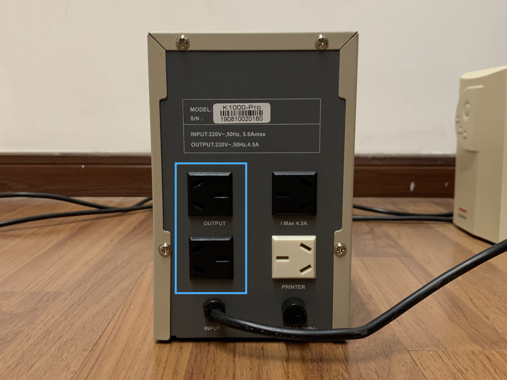

# 442 服务器硬件说明

这份文档记录一下 Dino 服务器的硬件连接情况。具体的服务器硬件参数可以查看第一篇文档的配置说明。

## 主机硬件组装

这部分与常规的主机配置一致。装过电脑主机的管理员对这部分应该不会陌生。

## UPS 是大号充电宝

为了保证在济事楼偶尔断电时能够保证正常运作，Dino 配备了两块备用电源 UPS。

```note:: UPS 即不间断电源（Uninterruptible Power Supply），是一种含有储能装置的不间断电源。主要用于给部分对电源稳定性要求较高的设备，提供不间断的电源。

```

主机电源部分功率高达 800w，需要两组交流电输入，因此有两组 UPS 电源。UPS 电源后侧有几类输出接口。



组装设备时，两路电源首先从插座分别连接到两组 UPS，再从 UPS 后面的常规输出口（左侧，带有标识 OUTPUT 的输出接口）连接到主机电源。连接其他输出接口可能导致设备不稳定。

## 机箱背面接口说明

主机后侧接口分为三个部分：


-   主板后侧接口区：连接键盘、鼠标、移动硬盘等；
-   显卡输出接口区：连接显示器；
-   电源接口区：连接 UPS 电源

连接时请注意，使用固定的以太网口（目前使用的是上侧以太口，IP 地址为 \*\*.\*\*.198.24），使用固定的显卡输出口（目前使用的是上侧第一张显卡的 HDMI 输出接口）。
